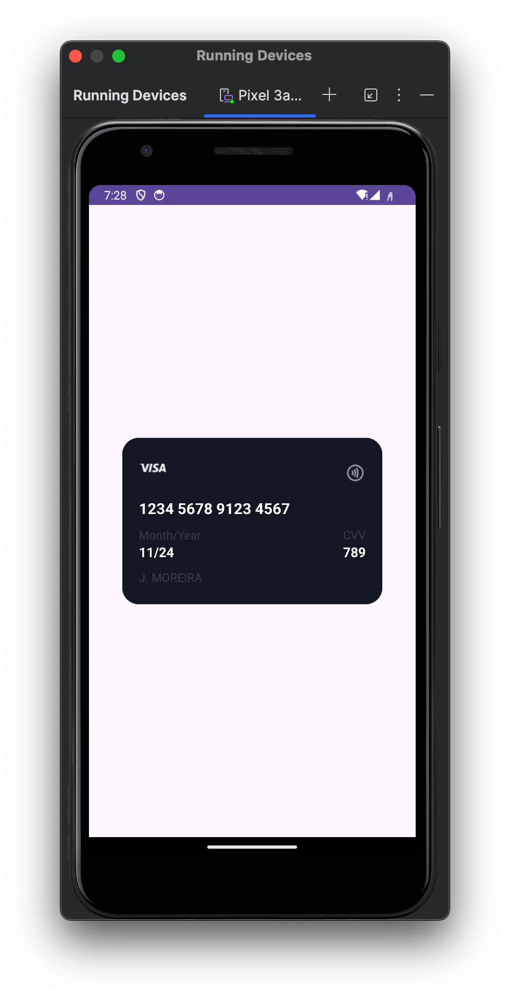
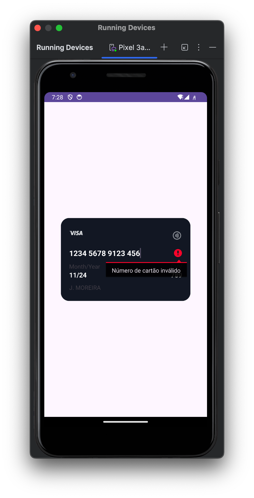

<h1 align="center">CardLayout UI 💳 </h1>

## Project 🎯 

Exercise 02 - Mobile Device Programming: "CardLayout UI" is a user-friendly Android app for simulating credit card input with real-time validation and intuitive design.
 

## Layout 🎨 

<div align="center">
  <table style="border-collapse: collapse; margin: 10px;">
    <tr>
      <td style="padding: 10px; text-align: center;">
        
      </td>
      <td style="padding: 10px; text-align: center;">
        
      </td>
    </tr>
  </table>
</div>

<!-- 
<div align="center" style="display: flex; justify-content: center;">
  <div style="margin: 10px;">
    
  </div>
  <div style="margin: 10px;">
    
  </div>
</div>

<div align="center">
  
</div> -->

## Technologies Used 🤖🍏

- **Programming Language:** Kotlin
- **Development Environment:** Android Studio

## Code Author 💻👨‍💻

```kotlin
fun main() {
    println("Code by Júnio Moreira!")
    println("Welcome to the UpDown Control!")
}
